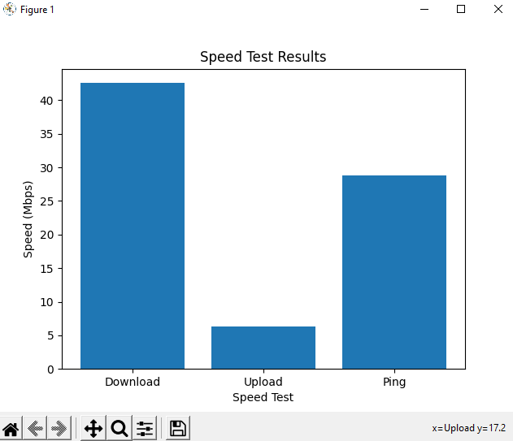

# SpeedyTest
SpeedyTest is a powerful command-line tool for measuring internet speed. With its advanced features and intuitive interface, it provides accurate and comprehensive speed test results. Whether you're a network administrator, developer, or simply want to monitor your internet connection, SpeedyTest is the perfect tool for the job.

## Features

- Measure download speed, upload speed, and ping latency.
- Generate detailed reports with graphical representation of speed test results.
- Save and export test results in various formats (CSV, JSON, etc.).
- Customize speed test parameters and server selection.
- Compare speed test results over time to track performance changes.
- Integrate SpeedyTest into your own applications using the provided API.
- track your timeline with saved database
- 
## Installation
```
git clone https://github.com/HalilDeniz/SpeedyTest.git
```
## Requirements

Before you can use SpeedyTest, you need to make sure that you have the necessary requirements installed. You can install these requirements by running the following command:

```
pip install -r requirements.txt
```

## Usage

Run the following command to perform a speed test:

```shell
python3 speendytest.py
```
# Visual Output
<br>


## Output
```
Receiving data \
Speed test completed!
Speed test time: 20.22 second
Server    : Farknet - Konya
IP Address: speedtest.farknet.com.tr:8080
Country   : Turkey
City      : Konya
Ping      : 20.41 ms
Download  : 90.12 Mbps
Loading   : 20 Mbps


```
## Contributing
Contributions are welcome! To contribute to SpeedyTest, follow these steps:

1. Fork the repository.
2. Create a new branch for your feature or bug fix.
3. Make your changes and commit them.
4. Push your changes to your forked repository.
5. Open a pull request in the main repository.


## Contact

If you have any questions, comments, or suggestions about PrivacyNet, please feel free to contact me:

- LinkedIn......: [LinkedIn](https://www.linkedin.com/in/halil-ibrahim-deniz/)
- TryHackMe.: [TryHackMe](https://tryhackme.com/p/halilovic)
- Instagram...: [Instagram](https://www.instagram.com/deniz.halil333/)
- YouTube.....: [YouTube](https://www.youtube.com/c/HalilDeniz)
- Email: halildeniz313@gmail.com

## License

SpeedyTest is released under the MIT License. See [LICENSE](LICENSE) for details.
